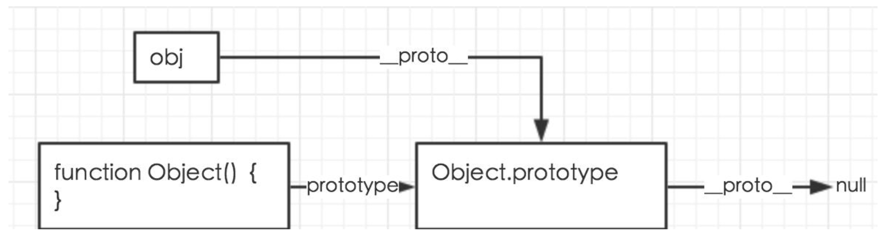

# 原型链

- [原型对象](http://www.ruanyifeng.com/blog/2011/06/designing_ideas_of_inheritance_mechanism_in_javascript.html)
- [深入理解原型链](https://segmentfault.com/a/1190000014717972)
- [内存图像](https://segmentfault.com/a/1190000005363885)

首先要搞明白几个概念：

```
1.函数（function）
2.函数对象(function object)
3.本地对象(native object)
4.内置对象(build-in object)
5.宿主对象(host object)
```

`prototype`主要是用来使普通对象共享原型对象(类)的属性和方法的。

`prototype`和`__proto__`一起使用用来实现原型对象(类)之前的继承的。

js中一切都是对象，那么对象中都含有`__proto__`属性，而`函数对象.prototype`指向的是一个对象，那么`函数对象.prototype`的里也会含有`__proto__`属性，原型链就此而来的。沿着`__proto__`属性对应的对象一直向上找，知道遇到`Object.prototype.__proto__`为止。

## 函数

```javascript
function foo(){

}
var foo = function(){

}
```

前者为函数声明，后者为函数表达式。typeof foo的结果都是`function`。

## 函数对象（原型对象）

函数就是对象

```text
官方定义， 在Javascript中,每一个函数实际上都是一个函数对象.
JavaScript代码中定义函数，或者调用Function创建函数时，最终都会以类似这样的形式调用Function函数:var newFun = new Function(funArgs, funBody)
```

以下说法成立:

```text
原型对象 == 函数对象 == 构造函数 == 类
```

其实也就是说，我们定义的函数，语法上，都称为`函数对象`，看我们如何去使用。如果我们单纯的把它当成一个`函数使用`，那么它就是`函数`，如果我们通过他来`实例化出对象来使用`，那么它就可以当成一个`函数对象`来使用，在面向对象的范畴里面，`函数对象类似于类的概念`。

```javascript
var foo1 = new function () {

}

function Foo() {

}
var foo2 = new Foo();

console.log(typeof foo1); // object
console.log(typeof foo2); // object
```

## 本地对象

```text
ECMA-262 把本地对象（native object）定义为“独立于宿主环境的 ECMAScript 实现提供的对象”。简单来说，本地对象就是 ECMA-262 定义的类（引用类型）。
```

主要包括:

```text
Object,Function,Array,String,Boolean,Number,Date,RegExp,Error,
EvalError,RangeError,ReferenceError,SyntaxError,TypeError,URIError.
```

```javascript
console.log(
    typeof Number,
    typeof Array,
    typeof Date,
    typeof RegExp,
    typeof Object,
    typeof String,
    typeof Boolean
);
// 输出的都是 function
```

也就是说其实这些本地对象（类）是通过function建立起来的，

```javascript
function Object(){

}
function Array(){

}
```

可以看出Object原本就是一个函数，通过`new Object()`之后实例化后，创建对象。类似于JAVA中的类。

## 内置对象

```text
ECMA-262 把内置对象（built-in object）定义为"由 ECMAScript 实现提供的、独立于宿主环境的所有对象，在 ECMAScript 程序开始执行时出现"。这意味着开发者不必明确实例化内置对象，它已被实例化了。ECMA-262 只定义了两个内置对象，即 Global 和 Math （它们也是本地对象，根据定义，每个内置对象都是本地对象）。
```

## prototype

prototype属性是每一个函数都具有的属性，但是不是每一个对象都具有的属性。比如

```javascript
function Person(age) {
    this.age = age;
}

var p = new Person(11)

console.log(p.__proto__ == Person.prototype); //输出 true
console.log(p.age) // 11
```

其中Person中有prototype属性，而p没有。但是p的隐含的`__proto__`属性指向Foo.prototype。

为什么会存在prototype属性？

Javascript里面所有的数据类型都是对象，为了使JavaScript实现面向对象的思想，就必须要能够实现'继承'使所有的对象连接起来。而如何实现继承呢？JavaScript采用了类似C++，java的方式，通过new的方式来实现实例。

通过new创建对象，分为以下三个步骤:

```javascript
var p = {}   // 1.创建空对象
p.__proto__ = Person.prototype   // 2.赋直 __proto__
Person.call(p) // 初始化属性和方法
```

大括号创建对象过程如下:

```javascript
var a = {};
```

分如下三步:

```javascript
var a = new Object();
a.__proto__ = Object.prototype
Object.prototype.__proto__ = null
```

## proto

`__proto__`属性是每一个对象以及函数都隐含的一个属性。对于每一个含有`__proto__`属性，他所指向的是`创建他的构造函数(原型对象)`的prototype。原型链就是通过这个属性构件的.

想像一下，如果一个函数对象（也称为构造函数）a的prototype是另一个函数对象b构建出的实例，a的实例就可以通过`__proto__`与b的原型链起来。而b的原型其实就是Object的实例，所以a的实例对象，就可以通过原型链和object的prototype链接起来。

```javascript
function A() {
    // 原型对象A
}

function B() {
    // 原型对象B
}
var b1 = new B(); // 实例对象b1
A.prototype = b1;
var a1 = new A(); // 实例对象a1
console.log(a1.__proto__ === b1); //true
console.log(a1.__proto__.__proto__ === B.prototype) //true
console.log(a1.__proto__.__proto__.__proto__ === Object.prototype) //true

console.log(B.prototype.__proto__ == Object.prototype) // true 原型对象B的原型链默指向Object

console.log(Object.prototype.__proto__); // null 最顶级的对象了
```

如果要理清原型和原型链的关系，首先要明确一下几个概念：

1.JS中的所有东西都是对象，函数也是对象, 而且是一种特殊的对象

2.JS中所有的东西都由Object衍生而来, 即所有东西原型链的终点指向Object.prototype

3.JS对象都有一个隐藏的`__proto__`属性，他指向创建它的构造函数的原型，但是有一个例外，`Object.prototype.__proto__`指向的是null。

4.JS中构造函数和实例(对象)之间的微妙关系

构造函数通过定义prototype来约定其实例的规格, 再通过 new 来构造出实例,他们的作用就是生产对象.

```javascript
function Foo(){

}
var foo = new Foo();
// foo其实是通过Foo.prototype来生成实例的。
```

构造函数本身又是方法(Function)的实例, 因此也可以查到它的`__proto__`(原型链)

```javascript
function Foo(){

}
// 等价于
var Foo= new Function（）；
```

而Function实际上是

```javascript
function Function(){
    Native Code
}
// 也就是等价于
var Function = new Function()；
```

所以说Function是`通过自己创建出来`的。正常情况下对象的`__proto__`是指向创建它的构造函数的prototype的.所以Function的`__proto__`指向的`Function.prototype`.

Object实际上也是通过Function创建出来的

```javascript
typeof(Object) //function
// 所以，
function Object(){
    Native Code
}
// 等价于
var Object = new Function();
```

那么Object的`__proto__`指向的是Function.prototype，也即是

```javascript
console.log(Object.__proto__ === Function.prototype);//true
```

下面再来看Function.prototype的`__proto__`指向哪里

因为JS中所有的东西都是对象，那么，Function.prototype 也是对象，既然是对象，那么Function.prototype肯定是通过Object创建出来的，所以，

```javascript
Function.prototype.__proto__ === Object.prototype //true
```

综上所述，Function和Object的原型以及原型链的关系可以归纳为下图。


对于单个的对象实例，如果通过Object创建，

```javascript
var obj = new Object();
```

那么它的原型和原型链的关系如下图



如果通过函数对象来创建

```javascript
function Foo(){

}
var foo = new Foo();
```

那么它的原型和原型链的关系如下图


那JavaScript的整体的原型和原型链中的关系就很清晰了，如下图所示


